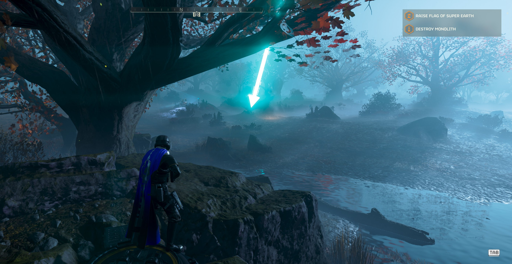

# Helldivers2ModManager — Linux Edition

A Linux-focused fork of [teutinsa/Helldivers2ModManager](https://github.com/teutinsa/Helldivers2ModManager),
a mod manager for the game Helldivers 2.

Upstream targets Windows. This fork adds Linux support (Steam/Proton path
detection, native packaging) without breaking Windows behavior, built on
[Tauri 2](https://tauri.app/) (Rust + Svelte). Built and verified on
[Bazzite](https://bazzite.gg/); it runs natively on Linux — no distrobox needed
to run it.

> Original project [website](https://teutinsa.github.io/hd2mm-site/index.html).

## Quick start — install and apply a mod

### 1. Get the app

Download it from the
[latest release](https://github.com/fmthola/Helldivers2ModManager/releases/latest),
or fetch and run it directly:

```bash
wget https://github.com/fmthola/Helldivers2ModManager/releases/latest/download/HD2ModManager.AppImage
chmod +x HD2ModManager.AppImage
./HD2ModManager.AppImage
```

If it does not start by double-click (no FUSE), run:
`APPIMAGE_EXTRACT_AND_RUN=1 ./HD2ModManager.AppImage`.

To add it to your app menu, run the app once, then from a clone of this repo run
`scripts/install.sh` (copies it to `~/.local/bin` and adds a "Helldivers 2 Mod
Manager" launcher).

### 2. Point it at the game (first run)

Open **Settings** (gear, bottom-left). The **Game Path** is auto-detected from your
Steam libraries (native and Flatpak). If it is empty, click **…** and browse to
`…/steamapps/common/Helldivers 2`. There should be no red error.

### 3. Add a mod

Click **Add** (bottom-left), pick a mod archive (`.zip`, `.7z`, or `.rar`). It
appears in the **Library** panel (which opens automatically).

### 4. Put it in your profile

In the Library, click the **insert** arrow (↵) on the mod to move it into your
active profile (the left list).

### 5. Choose options (if the mod has them)

On the mod in the profile, click the **pencil** button. Pick the variant in the
dropdown (e.g. Blue Glowing / Purple No-glow), then **OK**.

### 6. Deploy and play

Click **Deploy** — the selected variant's patch files are copied into
`…/Helldivers 2/data/`. Then click **Launch**, which starts Helldivers 2 through
Steam (validated — see the proof below). Modding can carry anti-cheat risk;
**Purge** before playing if you are unsure.

### 7. Remove mods (revert)

Click **Purge** to remove all deployed mod files and return the game to vanilla.
(`scripts/revert-mods.sh` does the same from the command line.)

### Proof — a deployed mod running in-game on Bazzite

The "Super Credit Arrows" mod (Blue Glowing) deployed with the steps above, then
launched, running in Helldivers 2 (the glowing blue arrow marks a Super Credit
pile):



## Status

🚧 **Early / preview.** Based on the upstream `v2.0.0.0_preview3` tag.

| Area | State |
| --- | --- |
| Install + run on Linux (AppImage) | ✅ Native, no distrobox |
| Steam library auto-detection (incl. Flatpak) | ✅ Confirmed |
| Add mod (`.zip`) + choose options | ✅ Confirmed |
| Deploy / purge mods (non-destructive) | ✅ Confirmed |
| Launch Helldivers 2 (modded) via Steam | ✅ Confirmed (in-game proof above) |
| AppImage / `.deb` packaging | ✅ Produced |
| Add mod from `.7z` / `.rar` | ⏳ Not yet exercised |
| Legacy & V1 manifest mods | ➖ Inherited from upstream |
| V2 manifest mods | ❌ Not implemented upstream yet (`todo!()`) |

How it was tested, with the full evidence, is at the bottom of this file.

---

The sections below are for review and validation: how modding works, how to build
it, and the testing, security, and DevSecOps process behind the status above.

## How modding works on Linux

Helldivers 2 runs under Proton. Proton runs the Windows game, which reads the
same `data/*.patch_*` files on any host OS. Deploying a mod copies patch-file
triplets (`<hex>.patch_N`, `.patch_N.gpu_resources`, `.patch_N.stream`) into
`<game>/data/`. Purge removes them. The deploy/purge logic is generic: the asset
names come from the mod's own files and the patch-file naming convention, not
from anything hard-coded.

The game install is detected by the presence of `tools/`, `data/`, `bin/`, and
`bin/helldivers2.exe`. The Windows executable is present under Proton, so
detection works unchanged.

## Building from source

A distrobox is only needed to build; running needs nothing but the AppImage.

Requirements: a Rust toolchain, Node.js + `pnpm`, and the Tauri 2 system
libraries (`webkit2gtk-4.1`, GTK 3, `libsoup-3.0`, `librsvg`, etc.).

```bash
pnpm install
pnpm tauri dev      # dev (hot reload)
pnpm tauri build    # release build + bundles (AppImage + .deb)
```

Artifacts are written to `src-tauri/target/release/bundle/`. To install the built
AppImage to the app menu: `scripts/install.sh`. The AppImage bundles GTK/WebKit
and stores its data under `~/.local/share/hd2mm`; verified on Bazzite (host glibc
2.43, FUSE present).

## Development environment

Developed and tested on **[Bazzite](https://bazzite.gg/)** (Fedora atomic,
immutable). Because the host is immutable, the build toolchain runs inside an
**Ubuntu [distrobox](https://distrobox.it/)** container, isolated from the host.
Helldivers 2 runs on the host via **Steam + Proton**. The app itself runs on the
host, not in the container.

## Code status

Last full run: 2026-06-19. Produced by the local suite in [`docs/TESTING.md`](docs/TESTING.md).
Raw artifacts: [`docs/evidence/`](docs/evidence/).

| Check | Result |
| --- | --- |
| SonarQube quality gate | ✅ Passed |
| Bugs | 0 |
| Vulnerabilities | 0 |
| Security hotspots | 0 |
| Code smells | 0 |
| Reliability rating | A |
| Security rating | A |
| Maintainability rating | A |
| Coverage (new code) | 94% (gate needs ≥ 80%) |
| Coverage (overall) | 33.7% |
| Duplication | 1.1% |
| Rust unit tests | 22 / 22 pass |
| Frontend unit tests | 8 / 8 pass |
| App launches (E2E) | ✅ |

The gate passes: 0 bugs, 0 vulnerabilities, 0 hotspots, 0 code smells, A/A/A
ratings, and new-code coverage of 94% (above the 80% threshold). Overall coverage
is 33.7% — the unit-tested logic (commands, models, parsers, archive guard, TS
utils) is covered; the Tauri command layer, UI, and bootstrap are exercised
end-to-end instead (see [`sonar-project.properties`](sonar-project.properties)
coverage exclusions).

### SonarQube gate result

The text gate report is in [`docs/evidence/sonar-report.txt`](docs/evidence/sonar-report.txt):

```
Quality Gate : OK
Bugs=0  Vulnerabilities=0  Code Smells=0  Security Hotspots=0
Reliability=A  Security=A  Maintainability=A
New-code coverage 94% (gate threshold 80%)
```

The SonarQube web UI screenshots are kept locally and are not committed (they show
the internal server's project view). Re-generate them with `scripts/sonar-evidence.sh`.

More: [running app window](docs/evidence/e2e-app-window.png).

## Validation Reports

### Tested environments

| Date | Distro / kernel | Steam type | HD2 build | Result | Notes |
| --- | --- | --- | --- | --- | --- |
| 2026-06-19 | Bazzite host + Ubuntu distrobox | Native | preview3 | ✅ | install, detect, add, options, deploy, purge, launch all confirmed |

### Test checklist

- [x] App builds from source on Linux
- [x] App launches and renders (E2E, `docs/evidence/e2e-app-window.png`)
- [x] AppImage runs natively on the Bazzite host
- [x] Game path auto-detected (native Steam)
- [x] Game-path validation passes for a valid install (Rust-backed)
- [x] Path-traversal guard logic unit-tested
- [x] Window close button works
- [x] Add mod from `.zip` (lands in the library; UI notifies + opens it)
- [x] Mod options shown and selectable in the UI (`docs/evidence/e2e-options.png`)
- [x] Deploy writes the selected option's patch files into `<game>/data/`
- [x] Purge removes deployed patch files and restores the baseline
- [x] Game launches modded via Steam (`steam://launch/553850`) — in-game proof above
- [ ] `.deb` installs/runs in a Debian/Ubuntu environment
- [ ] Game path auto-detected (Flatpak Steam)
- [ ] Game path auto-detected (mod on second drive via `libraryfolders.vdf`)
- [ ] Add mod from `.7z`
- [ ] Add mod from `.rar`

### Report log

**2026-06-19 — initial bring-up.** Rust unit tests pass. Frontend build clean. App
E2E: launched via `tauri-driver`, UI rendered, screenshot captured. Steam
auto-detection confirmed. SonarQube: 0 bugs, 0 vulnerabilities, ratings A/A/A;
coverage added (10.2% overall), so the gate fails on new-code coverage (59.8% <
80%). Fixed: game-path validation moved to Rust (the Settings error is gone);
AppImage runs on the host (writable data dir); WebKit black-screen on NVIDIA.

**2026-06-19 — regression vs upstream.** Same checks run against this fork and a
clean upstream build ([`docs/evidence/regression.txt`](docs/evidence/regression.txt)).
Render, minimize, and settings-page close are identical. The main-page window
close button was broken in upstream too (not a regression here); fixed via
`preventDefault` + `destroy()` after saving profiles.

**2026-06-19 — mod deploy/purge + launch.** Added SuperCreditArrows.zip and ran a
full deploy/purge round-trip against the real game install
([`docs/evidence/deploy-test.txt`](docs/evidence/deploy-test.txt)). Backup first:
the data dir baseline was snapshotted and a standalone `scripts/revert-mods.sh`
added; deploy only adds files and the base game has no matching patch files, so it
is non-destructive. Deploy wrote the selected option's patch files; purge removed
them and the dir matched the baseline exactly. The game was then launched and the
mod is visible in-game ([`docs/evidence/in-game-bazzite.jpg`](docs/evidence/in-game-bazzite.jpg)).

## Validation and DevSecOps

Development is local. There is no CI service. The pipeline is plain shell scripts.
Secrets and the SonarQube URL are read from the local credential store (KWallet)
at run time and are never stored in the repo.

The four stages, and how each keeps the code valid and secure:

### Build

```bash
scripts/build.sh
```

Installs deps, builds the frontend, compiles the Tauri release binary, and
produces the AppImage and `.deb`.

### Test

```bash
pnpm test                 # Rust unit tests + app E2E
pnpm run build:checked     # i18n + frontend type/compile check
```

- **Rust unit tests** cover the security-relevant logic: the archive
  path-traversal guard, install validation, and patch-file matching.
- **App E2E** drives the real packaged binary through `tauri-driver` +
  `WebKitWebDriver` and screenshots it. Playwright is not used; it cannot drive a
  Tauri window.

### Scan

```bash
scripts/sonar.sh           # coverage + SonarQube scan + quality-gate check
scripts/sonar-evidence.sh  # capture the SonarQube UI screenshots
```

Self-hosted SonarQube analyses the code for bugs, vulnerabilities, security
hotspots, and code smells, and imports test **coverage**. The quality gate is the
go/no-go signal. The loop is: scan → read the gate and issues → fix → re-scan,
until it is green.

**Why coverage matters.** Static analysis only flags what it can see. Coverage
shows how much of the code the tests exercise. Low coverage means large parts are
unproven, so "0 bugs found" is weaker than it looks. The gate enforces a coverage
condition (≥ 80% on new code); new-code coverage is currently 94%, so the gate
passes. Unit tests cover the logic (commands, models, parsers, the archive guard,
TS utils); the Tauri command layer, UI, and bootstrap are covered end-to-end and
excluded from the coverage metric.

### Deploy

Release artifacts (AppImage, `.deb`) are built by `scripts/build.sh` and published
to GitHub Releases once end-to-end mod testing on a real install passes.

### Security fixes and open findings

- **Fixed:** a path-traversal (zip-slip) flaw in 7z/RAR extraction. A crafted
  archive could write outside the mod directory. Covered by unit tests.
- **Resolved:** all SonarQube findings. The four cognitive-complexity functions
  (`deploy`, `add_mods`, `normalize_paths`, `validate`) were refactored into small
  helpers, and the TS/JS smells were fixed. Current state: 0 bugs, 0
  vulnerabilities, 0 hotspots, 0 code smells.
- **Tracked:** further hardening (CSP, manifest asset path validation).

> ⚠️ Modding online games can carry risk with anti-cheat. Use at your own
> discretion and purge mods before playing if unsure.

## Relationship to upstream

- `upstream` → https://github.com/teutinsa/Helldivers2ModManager (Windows-first source)
- `origin` → this fork (Linux-focused)

Linux work lives on the `linux/main` branch. Focused changes may be split into
branches such as `linux/steam-library-detection` or `linux/appimage-packaging`
and proposed upstream as pull requests where appropriate.

## License

MIT, same as upstream.
